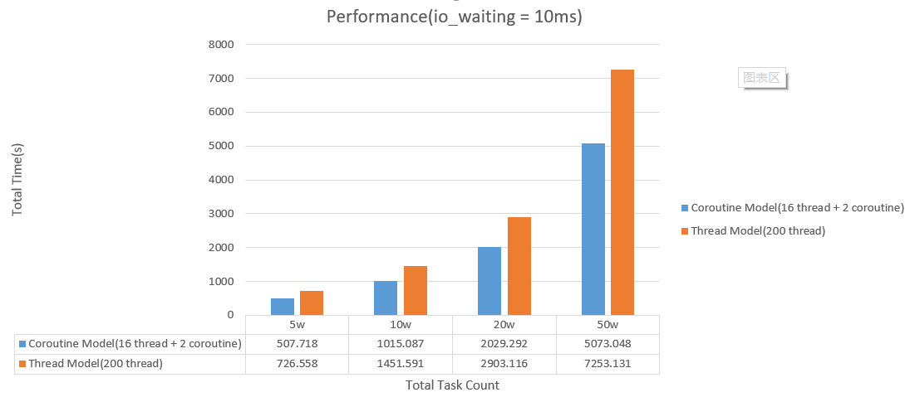

The example of Coroutines in java was using [coroutines](https://github.com/offbynull/coroutines) 

You can use this example to compare the performance between the tradinational thread model with coroutines model.

### Step 1
mvn clean install

### Step 2
Examples   
java -jar target\coroutine-model-jar-with-dependencies.jar   

Usage: java -jar jarfile [args...]    
       (to execute a jar file)    
where args include:    
         first : simulator task count, default is 1000    
        second : io waiting time for each task, default is 10ms    
         third : max thread to handle the task when using thread model, default is 200    
                 coroutine model will ignore this parameter    
Examples:    
          java -jar thread-model-jar-with-dependencies.jar 1000 10 200    
          java -jar coroutine-model-jar-with-dependencies.jar 1000 10    

Here is performance report    

From the result showed, we can have a clear answer, if there are existing huge thread in your application and many of them are blocked. In this scenario coroutine model have much better performance than the tradicational model.
